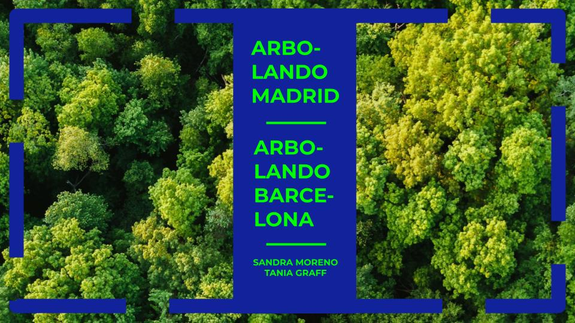

# Módulo 4
## Arbolando Madrid | Arbolando Barcelona. Análisis de las zonas verdes de Madrid y Barcelona para ubicar el próximo parque urbano de la ciudad.
*Equipo desarrollo:* Sandra Moreno y Tania Graff 

*Herramienta visualización:* Power BI Desktop

El Ministerio para la Transición Ecológica y Reto Demográfico nos encargó la realización de un análisis preliminar de los espacios verdes de Madrid y Barcelona para ubicar el próximo parque urbano de la ciudad. Para determinar cuál es el distrito más idóneo en cada ciudad, se han analizado 4 variables: los espacios verdes disponibles, la renta per capita, la densidad de población y la contaminación de cada distrito. 



## **FASE 1: Exploración, Limpieza y Transformación el Conjunto de Datos**

Los seis datasets explorados para realizar el análisis de Barcelona, se han obtenido del Open Data facilitado por el Ayuntamiento de Barcelona [Open Data Ajuntament de Barcelona](https://opendata-ajuntament.barcelona.cat/es/). Se ha automatizado la primera fase del proceso de transformación y limpieza de datos de estos datasets, obteniendo seis archivos .csv que permiten ordenar los diez distritos en los que se divide la ciudad en función de las 4 variables a analizar.

Los xx datasets explorados para realizar el análisis de Madrid, se han obtenido del 

   
### **Ejecución de la Limpieza y Transformación de Datos**
El proceso de limpieza y transformación de datos está automatizado mediante un script en Python. Sigue estos pasos para ejecutar el script:

**1. Clona el Repositorio:**

```python
git clone https://github.com/TaniaGraff/Repo_Modulo4_PowerBI
cd Modulo4/ETL_limpieza_y_transformacion_archivos
```
**2. Ejecuta el Script de Limpieza y Transformación:**
Navega a la carpeta `ETL_limpieza_y_transformacion_archivos/scripts` y ejecuta el script `main.py`:

```python
python scripts/main.py
```

Este script procesará los datos descargados y generará archivos limpios y transformados en la carpeta `ETL_limpieza_y_transformacion_archivos/data/output_data`.

**3. Verifica los Archivos Procesados:**
Revisa la carpeta `output_data` para asegurarte de que los archivos procesados se han generado correctamente. Estos archivos estarán listos para ser utilizados en Power BI para la creación del dashboard.

## **FASE 2: Identificación de Objetivos**

### **Objetivos**

**1. Identificación de la Ubicación:** Seleccionar el mejor distrito para ubicar el próximo parque urbano de Madrid y Barcelona en base al análisis de los siguientes factores.

**2. Análisis de Factores:** Evaluar cómo los distintos factores considerados en el análisis, influyen a la hora de ordenar los distritos: 

- `Espacios verdes`: Cuantifica y clasifica la cantidad de espacios verdes con los que cuenta cada distrito.

- `Densidad de población`: Cuantifica la densidad de población de cada distrito.

- `Renta per Capita`: Cuantifica los ingresos promedio indicando la riqueza económica de cada distrito.

- `Contaminación`: Mide la cantidad de contaminantes registrados en cada distrito.

**3. Visualización de Datos:** Proporcionar visualizaciones claras y comprensibles para facilitar la toma de decisiones informadas y elegir la mejor ubicación para establecer el próximo parque urbano de la ciudad.

**4. Concienciación:** Concienciar a los estamentos gubernamentales locales y las asociaciones vecinales de la necesidad de crear un nuevo parque urbano en la ciudad.

### **Preguntas Clave:**

Para la identificación de la ubicación:
- ¿Cuántos espacios verdes tiene Barcelona? ¿Y Madrid?
- ¿Cómo se categorízan los espacios verdes de Barcelona? ¿Y los de Madrid?
- ¿En qué distritos se concentran los espacios verdes de Barcelona? ¿Y en Madrid?
- ¿En qué distritos se concentran los parques de Barcelona? ¿Y en Madrid?
- ¿Los distritos que más parques concentran son los que tienen una mayor renta per capita?
- ¿Los distritos que más parques concentran son los que más población concentran?
- ¿Los distritos que más parques concentran son los que más contaminación acumulan?
- ¿Son los parques la tipología de espacio verde más predominante en Barcelona? ¿Y en Madrid?
- ¿Hay una relación clara entre los espacios verdes y la densidad de población?
- ¿Hay una relación clara entre los parques y la densidad de población?
- ¿Hay una relación clara entre los espacios verdes y la renta per capita?
- ¿Hay una relación clara entre los parques y la renta per capita?
- ¿Hay una relación clara entre los espacios verdes y los niveles de contaminación?

Plantear alternativas a la creación de un parque urbano en caso de que su creación no fuera posible por la idiosincracia de cada ciudad.

## **FASE 3: Casos de Uso**
### **Público Objetivo del Dashboard**
Los dashboards resultantes están dirigidos a:

**Administración Pública** para que puedan determinar el mejor distrito para ubicar el próximo parque urbano de Madrid y Barcelona, y dotar a la municipalidad del presupuesto necesario para ejecutar el proyecto.

**Asociaciones Vecinales** para que puedan presionar a las administraciones gubernamentales de la necesidad de crear un nuevo parque urbano en la ciudad.

### **Visualizaciones realizadas en Power BI**

Los dashboards incluyen varias visualizaciones clave para facilitar el análisis y la interpretación de los datos. Visualizaciones como:

**Mapa de formas** para ordenar los distritos en función de cada variable analizada.

**Gráfico temporal** que muestra la creación de espacios verdes a lo largo de los años.

**Gráficos de dispersión** que muestran la correlación entre algunos de los factores analizados.

**Gráfico de pastel o quesitos** que muestran la concentración de parques por distritos.

Para ver el dashboard de Arbolando Barcelona, ejecutar en Power BI el archivo **arbolando_barcelona.pbix**

Para ver el dashboard de Arbolando Madrir, ejecutar en Power BI el archivo 