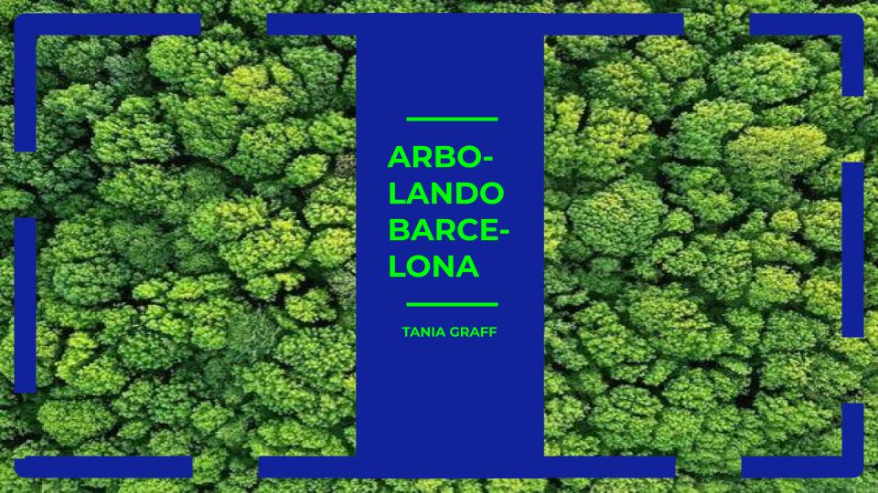

# Módulo 4
## Arbolando Barcelona. Análisis de las zonas verdes de Barcelona para ubicar el próximo parque urbano de la ciudad.
**Equipo desarrollo**: Tania Graff

*Herramienta visualización:* Power BI Desktop

El Ministerio para la Transición Ecológica y Reto Demográfico encargó la realización de un análisis preliminar de los espacios verdes de Barcelona para ubicar el próximo parque urbano de la ciudad. Para determinar cuál es el distrito más idóneo, se han analizado 4 variables: los espacios verdes, la renta per capita, la densidad de población y la contaminación de cada distrito. Los siete dataset analizados, se han obtenido del Open Data facilitado por el Ayuntamiento de Barcelona [Open Data Ajuntament de Barcelona](https://opendata-ajuntament.barcelona.cat/es/).



## **FASE 1: Exploración, Limpieza y Transformación el Conjunto de Datos**

Se ha automatizado la primera fase del proceso de transformación y limpieza de datos para crear seis archivos .csv que permiten rankear los diez distritos en los que se divide Barcelona en función de las 4 variables a analizar.

### **Estructura de archivos**
**Data**
- Archivos .csv de entrada:
    - 2021_densitat.csv
    - 2021_qualitat_aire_estacions.csv
    - BarcelonaCiutat_Districtes.csv
    - opendatabcn_cultura_parcs-i-jardins.csv
    - qualitat_aire_contaminants.csv
    - Renta_Per_Capita_Barris_Barcelona.csv 
- Archivos .csv de salida:
    - contaminacion_barcelona.csv
    - contaminantes_barcelona.csv
    - densidad_poblacion_barcelona.csv
    - distritos_barcelona.csv
    - parques_y_jardines_barcelona.csv
    - renta_per_capita_barcelona.csv

### **Ejecución de la Limpieza y Transformación de Datos**
El proceso de limpieza y transformación de datos está automatizado mediante un script en Python. Sigue estos pasos para ejecutar el script:

**1. Clona el Repositorio:**

```python
git clone https://github.com/TaniaGraff/Repo_Modulo4_PowerBI
cd Modulo4/ETL_limpieza_y_transformacion_archivos
```
**2. Ejecuta el Script de Limpieza y Transformación:**
Navega a la carpeta `ETL_limpieza_y_transformacion_archivos/scripts` y ejecuta el script `main.py`:

```python
python scripts/main.py
```

Este script procesará los datos descargados y generará archivos limpios y transformados en la carpeta `ETL_limpieza_y_transformacion_archivos/data/output_data`.

**3. Verifica los Archivos Procesados:**
Revisa la carpeta `output_data` para asegurarte de que los archivos procesados se han generado correctamente. Estos archivos estarán listos para ser utilizados en Tableau para la creación del dashboard.

## **FASE 2: Identificación de Objetivo**

### **Objetivos**

**1. Identificación de Ubicación:** Seleccionar el mejor distrito para ubicar el próximo parque urbano de la ciudad en base al análisis de los siguientes factores.

**2. Análisis de Factores:** Evaluar cómo los distintos factores considerados en el análisis, influyen en el ranking de los distritos: 

- `Ladder Score` (Puntaje de Escalera): Mide el nivel general de felicidad de un país.

- `Logged GDP per Capita`: PIB per cápita ajustado, indicando la riqueza económica del país.

- `Social Support` (Apoyo Social): Mide la percepción de apoyo social en el país.

- `Healthy Life Expectancy` (Expectativa de Vida Saludable): Mide la cantidad de años que se espera que una persona viva en buena salud.

- `Freedom to Make Life Choices` (Libertad para Tomar Decisiones en la Vida): Mide la percepción de libertad para tomar decisiones importantes en la vida.